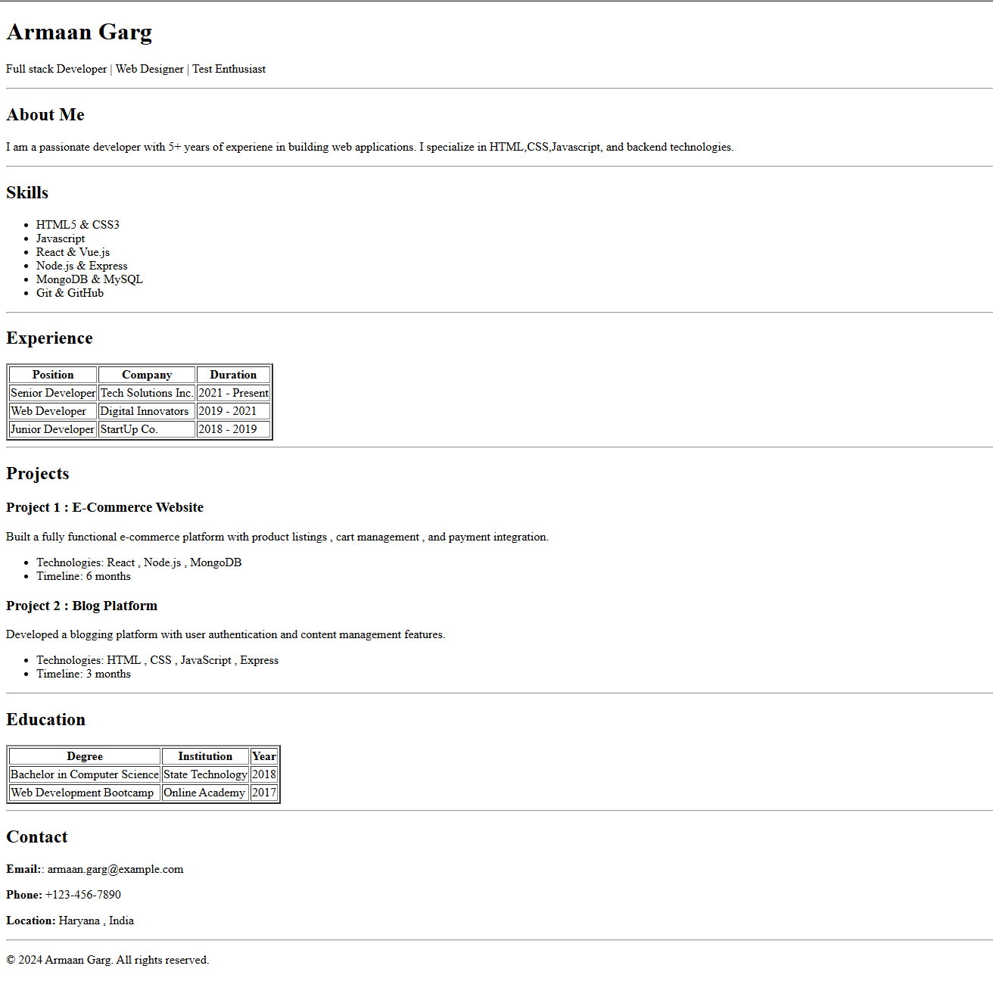

# Resume
Resume assignment
This project is a simple resume webpage built using pure HTML5.
It demonstrates proper use of semantic HTML elements, structured content, and clean markup as part of an HTML fundamentals assignment.
Technologies Used

HTML5

Semantic tags (header, main, section, footer)

Tables, lists, headings, and text formatting
How to Run

Clone the repository:

git clone https://github.com/armaangarg73/Resume.git

Open the project folder

Double-click index.html
OR open it using any web browser

